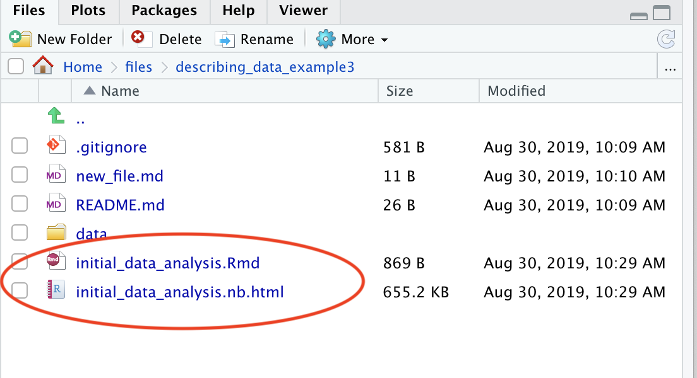

# Setting up the workflow with a github repo and RStudio 

-----

#### HISTORY

* 8/29/19 mbod - initial version of setup steps

-----

## Overview

* The objective is to set up your data analysis workflow in a reproducible manner right from the first steps of acquiring, preparing, cleaning and doing initial analysis of your data.

* The key components of this approach are:
  1. Using a version control system and an online github repo (Private or Public) for file tracking.
  2. Adopting a notebook literate programming approach to developing your scripts using RMarkdown to document each step in the process and serve a reproducible record of all stages of analysis.
  

## Steps

### 1. Start a new `github` repository

* In a browser go to github.com and make sure you are logged into your account.

* Create a new repository and give it a useful name.
  * Don't use spaces in file, folder or repo names. Use underscores instead
    * __NOT__ `my awesome repo`
    * __BUT__ `my_awesome_repo`


* Depending on the sensistivity of your data and the stage of the analysis you can choose to create either
  1. __A public repository__ which will be viewable by anyone browsing your github files.
  2. __A private repository__ which only you and any other github users you add as collaborators will be able to see.
  
  The otherall github and open science ethos is to have your repository be open and publicly available. But there can be good reasons to use a private repository during to the analysis process and then to set up a public one with just the derived and selected data.
  
* There are two approaches to setting up the repo and linking to your local filesystem.
  1. Create an empty repo on github with no `README.md`, `.gitignore` or license files. Then you initialize a folder under git on your local filesystem and link it to the remote github repo. We took this approach in the lab session.
  2. Create a `README.md` file and optionally select a `.gitignore` file and license before you hit __Create repository__. Then you can clone the new repo on your local filesystem. I think this second approach may actually be more straight forward.
  
  
* Once created you will see the initial `README.md` and any other files you selected.


### 2. Link the repository to your local filesystem.

* Here we will use a terminal command line version of `git` to link your new repository to the local filesystem. 
  * But there are a couple of other options we can document in future
    * The git version control integration in RStudio
    * GUI git tools like GitDesktop
    
* __Navigate to where you want to keep repository folder on your filesystem.__
  * You can use the terminal/console outside of RStudio
  
  
  
  * Or the __Terminal__ tab in RStudio
  
  
  
  
  
  


* __Depending on which of the two options for creating a github repo you used above__

  1. **APPROACH #1** _Empty repo_ (more complex approach)
      1. create a folder with the same name as the repo:
      
          ```
          mkdir my_awesome_repo
          ```
          
      2. initialize it as a git repository
      
          ```
          git init
          ```
          
      3. add one or more files to git version tracking
      
          ```
          echo "Describing your data example" >> README.md
          git add README.md
          ```
          
      4. commit the changes to your local repo (use a sensible and interpretable message as it will appear on github by associated files)
      
          ```
          git commit -m 'Initial setup and commit'
          ```
      
      5. Add the github repo as the remote link to your local git repository and push your changes
      
          ```
          git remote add origin https://github.com/[USERNAME]/[REPO_NAME].git
          git push -u origin master
          ```
          
      These steps are documented when you create a new empty repo on github:
      
      
          
      And they are the steps we tried (some with more success and ease than others) in the first lab session!
      
  2. **APPROACH #2** __Clone minimal repo from github__ (recommended and less complex)
  
     1. If you added a `README.md` when you created the repo on github then you can just clone that repo to your local filesystem like this:
     
          ```
          git clone https://github.com/[USERNAME]/[REPO_NAME].git
          ```
          
     2. Then it should be all set up to add new files locally and then follow the _add_, _commit_ and _push_ cycle for updating. For example:
     
          ```
          echo 'a new file' > new_file.md
          git add new_file.md 
          git commit -m 'an update'
          git push -u origin master
          ```
          

### 3. Add data and RMarkdown notebook and start describing your data in RStudio
   
1. In RStudio navigate to this local folder and add a `data` folder with your data files in.
   
    * In __Files__ browser
      
   
   
      
    * Or in __Terminal__ tab
    
      ```
      mkdir data
      cp [PATH_TO_DATA_FILE] data
      ```
      
      
2. Create a new R Notebook

    ```
    File > New File > R Notebook
    ```

    

    This will give you a template RMarkdown notebook that you work from.

    
    
    But first save it to your local repo folder. You'll see both a `[FILENAME].Rmd` and `[FILENAME].nb.html` file created. The latter is the HTML preview file used for interactive viewing in notebook mode.
    
    


3. Add the new file to git, commit and push to your github repo.

  * In the __Terminal__ tab (or console/terminal oustide RStudio)

  ```
  git add initial_data_analysis.Rmd data
  git commit -m 'initial analysis notebook and data commit'
  git push
  ```
  
  * Then on github.com you should see these files added to your repo.
  
  
  