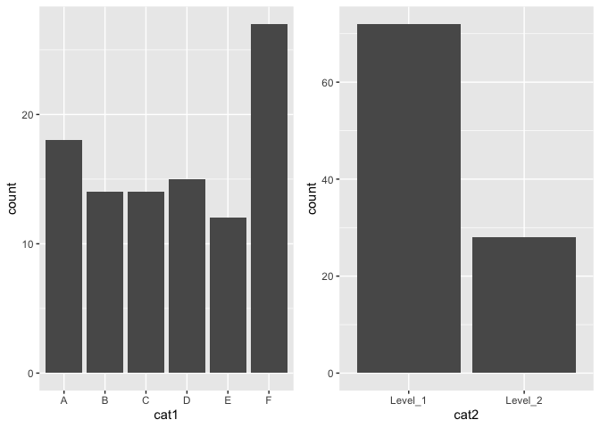
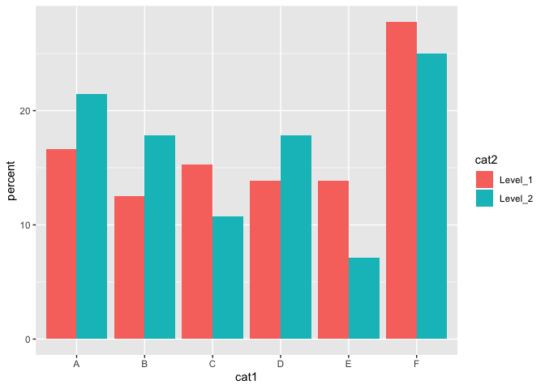
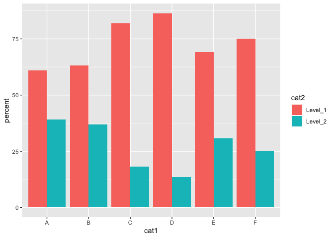
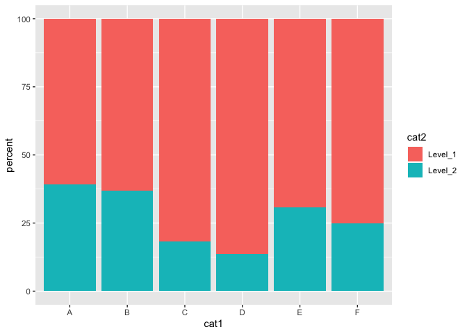
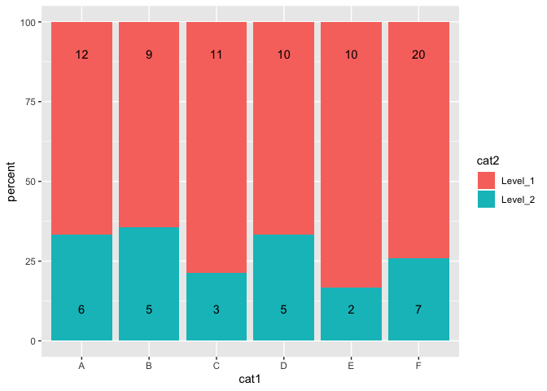

# Some notes from lab session on 10/17/19

## Multiple output formats 

* I looked a bit more into this one and it looks like the __KNIT__ button will generate the first of the output formats in your `YAML` header.

* So if your header looks like:

```
---
title: "Some bar chart examples"
author: "mbod"
date: "10/17/2019"
output: 
  pdf_document: default
  html_document:
    keep_md: yes
---
```

and you hit , then it will attempt to create a PDF document from your RMarkdown but __NOT__ continue on and create the HTML and Markdown outputs.

* If you flip the order:

```
---
title: "Some bar chart examples"
author: "mbod"
date: "10/17/2019"
output:
  html_document:
    keep_md: yes
  pdf_document: default
---
```

then hitting  will create HTML and Markdown outputs only.


* You can select specific outputs not specified in your YAML header from the Knit menu:


#### Creating all outputs in your `YAML` header

* If you do want to create all the outputs listed in your RMarkdown document YAML header then you can use this function in the __Console__.<br/><br/>
  1. Make sure your current working directory is set to the location of your RMarkdown document:
     e.g.
```
       > getwd()
       
       [1] "/Users/mattodonnell"
```
    <br/>
      so need to set the working directory, e.g.:
```
      > setwd('/Users/mattodonnell/files/COMM783_describing_your_data_...etc..some_visualizations')
```
  <br/>
  2. Use the `rmarkdown::render()` function:
```
      rmarkdown::render('ggplot2_barplot_with_grouping.Rmd', outputs='all')
```
      
      

## Crosstabs and `ggplot2` bar plot examples

#### A question came up about how to create a crosstab of two category variables and then display the result in a grouped (but not stacked) bar graph.


1. First generate a table with two categorical variables: 
  * `cat1`
    * `levels: A, B, C, D, E`
  * `cat2`
    * `levels: Level_1, Level_2`


```r
df<- data.frame(cat1=sample(c('A','B','C','D', 'E','F'), 100, replace=TRUE),
           cat2=sample(c('Level_1','Level_2'), 100, replace=TRUE, prob = c(0.7,0.3))
)
```

2. Let's take a look at the top 12 rows and here use the tidyverse pipeline style:


```r
df %>% 
  head(12) %>% 
    kable() %>% 
      kable_styling(bootstrap_options = c("striped", "hover"))
```

<table class="table table-striped table-hover" style="margin-left: auto; margin-right: auto;">
 <thead>
  <tr>
   <th style="text-align:left;"> cat1 </th>
   <th style="text-align:left;"> cat2 </th>
  </tr>
 </thead>
<tbody>
  <tr>
   <td style="text-align:left;"> E </td>
   <td style="text-align:left;"> Level_2 </td>
  </tr>
  <tr>
   <td style="text-align:left;"> E </td>
   <td style="text-align:left;"> Level_1 </td>
  </tr>
  <tr>
   <td style="text-align:left;"> A </td>
   <td style="text-align:left;"> Level_1 </td>
  </tr>
  <tr>
   <td style="text-align:left;"> A </td>
   <td style="text-align:left;"> Level_1 </td>
  </tr>
  <tr>
   <td style="text-align:left;"> F </td>
   <td style="text-align:left;"> Level_1 </td>
  </tr>
  <tr>
   <td style="text-align:left;"> D </td>
   <td style="text-align:left;"> Level_2 </td>
  </tr>
  <tr>
   <td style="text-align:left;"> E </td>
   <td style="text-align:left;"> Level_2 </td>
  </tr>
  <tr>
   <td style="text-align:left;"> F </td>
   <td style="text-align:left;"> Level_1 </td>
  </tr>
  <tr>
   <td style="text-align:left;"> A </td>
   <td style="text-align:left;"> Level_2 </td>
  </tr>
  <tr>
   <td style="text-align:left;"> C </td>
   <td style="text-align:left;"> Level_2 </td>
  </tr>
  <tr>
   <td style="text-align:left;"> C </td>
   <td style="text-align:left;"> Level_1 </td>
  </tr>
  <tr>
   <td style="text-align:left;"> D </td>
   <td style="text-align:left;"> Level_2 </td>
  </tr>
</tbody>
</table>

* The `kable` functions (see inclusion of `kable` and `kableExtra` libraries above in first code block) provide ways of producing nicely formatted and grouped table output.

* And it can apply to a range of outputs, e.g. HTML, PDF and Word. See https://cran.r-project.org/web/packages/kableExtra/vignettes/awesome_table_in_html.html


3. Plot distributions of categorical variables.

* The `gridExtra` library provides a way of including more than one plot in a figure in various arrangements. This is really useful when the plots are sub-levels of a single or combination of variables where you might use _facets_ or _grouping_.


```r
p1 <- df %>% ggplot(aes(cat1)) + geom_histogram(stat='count', binwidth=1)
```

```
## Warning: Ignoring unknown parameters: binwidth, bins, pad
```

```r
p2 <- df %>% ggplot(aes(cat2)) + geom_histogram(stat='count', binwidth=1)
```

```
## Warning: Ignoring unknown parameters: binwidth, bins, pad
```

```r
grid.arrange(p1,p2, nrow=1)
```

<!-- -->

4. Create a cross tabulation of the two categorical variables.

* In the tidyverse paradigm you can use the `group_by()` function followed by the `summarise()` function to crate a cross tabulation:


```r
df %>% group_by(cat1, cat2) %>%
  summarise(cnt=n())
```

```
## # A tibble: 12 x 3
## # Groups:   cat1 [6]
##    cat1  cat2      cnt
##    <fct> <fct>   <int>
##  1 A     Level_1    12
##  2 A     Level_2     6
##  3 B     Level_1     9
##  4 B     Level_2     5
##  5 C     Level_1    11
##  6 C     Level_2     3
##  7 D     Level_1    10
##  8 D     Level_2     5
##  9 E     Level_1    10
## 10 E     Level_2     2
## 11 F     Level_1    20
## 12 F     Level_2     7
```

* To create a crosstab like table you can add the `spread()` function to the end of the pipeline.


```r
df %>% group_by(cat1, cat2) %>%
  summarise(cnt=n()) %>%
    spread(cat2, cnt)
```

```
## # A tibble: 6 x 3
## # Groups:   cat1 [6]
##   cat1  Level_1 Level_2
##   <fct>   <int>   <int>
## 1 A          12       6
## 2 B           9       5
## 3 C          11       3
## 4 D          10       5
## 5 E          10       2
## 6 F          20       7
```

* Changing the order of the variables in the `group_by()` function will change the order of the rows and columns.

* You can also then add header and grouping rows to the table using `kable` and related functions (see https://cran.r-project.org/web/packages/kableExtra/vignettes/awesome_table_in_html.html#group_rows_via_multi-row_cell)


```r
df %>% group_by(cat2, cat1) %>%
  summarise(cnt=n()) %>%
      spread(cat1, cnt) %>%
        kable() %>%
            kable_styling() %>%
              add_header_above(c(' '=1, 'cat1'=length(levels(df$cat1))))
```

<table class="table" style="margin-left: auto; margin-right: auto;">
 <thead>
<tr>
<th style="border-bottom:hidden" colspan="1"></th>
<th style="border-bottom:hidden; padding-bottom:0; padding-left:3px;padding-right:3px;text-align: center; " colspan="6"><div style="border-bottom: 1px solid #ddd; padding-bottom: 5px; ">cat1</div></th>
</tr>
  <tr>
   <th style="text-align:left;"> cat2 </th>
   <th style="text-align:right;"> A </th>
   <th style="text-align:right;"> B </th>
   <th style="text-align:right;"> C </th>
   <th style="text-align:right;"> D </th>
   <th style="text-align:right;"> E </th>
   <th style="text-align:right;"> F </th>
  </tr>
 </thead>
<tbody>
  <tr>
   <td style="text-align:left;"> Level_1 </td>
   <td style="text-align:right;"> 12 </td>
   <td style="text-align:right;"> 9 </td>
   <td style="text-align:right;"> 11 </td>
   <td style="text-align:right;"> 10 </td>
   <td style="text-align:right;"> 10 </td>
   <td style="text-align:right;"> 20 </td>
  </tr>
  <tr>
   <td style="text-align:left;"> Level_2 </td>
   <td style="text-align:right;"> 6 </td>
   <td style="text-align:right;"> 5 </td>
   <td style="text-align:right;"> 3 </td>
   <td style="text-align:right;"> 5 </td>
   <td style="text-align:right;"> 2 </td>
   <td style="text-align:right;"> 7 </td>
  </tr>
</tbody>
</table>

5. Add a new column to the grouped table using the `mutate()` function.

  * Here we first `group_by()` the two categorical variables
  * and then create a summary variable `cnt` that counts the number of grouped rows in each combination
  * and finally we can add a new column `percent` with the formula:
    ```
    cnt/sum(cnt)
    ```


```r
df %>% group_by(cat1, cat2) %>%
  summarise(cnt=n()) %>% 
    mutate(percent=round(100*cnt/sum(cnt),2)) %>%
      kable() %>%
        kable_styling('border')
```

<table class="table table-bordered" style="margin-left: auto; margin-right: auto;">
 <thead>
  <tr>
   <th style="text-align:left;"> cat1 </th>
   <th style="text-align:left;"> cat2 </th>
   <th style="text-align:right;"> cnt </th>
   <th style="text-align:right;"> percent </th>
  </tr>
 </thead>
<tbody>
  <tr>
   <td style="text-align:left;"> A </td>
   <td style="text-align:left;"> Level_1 </td>
   <td style="text-align:right;"> 12 </td>
   <td style="text-align:right;"> 66.67 </td>
  </tr>
  <tr>
   <td style="text-align:left;"> A </td>
   <td style="text-align:left;"> Level_2 </td>
   <td style="text-align:right;"> 6 </td>
   <td style="text-align:right;"> 33.33 </td>
  </tr>
  <tr>
   <td style="text-align:left;"> B </td>
   <td style="text-align:left;"> Level_1 </td>
   <td style="text-align:right;"> 9 </td>
   <td style="text-align:right;"> 64.29 </td>
  </tr>
  <tr>
   <td style="text-align:left;"> B </td>
   <td style="text-align:left;"> Level_2 </td>
   <td style="text-align:right;"> 5 </td>
   <td style="text-align:right;"> 35.71 </td>
  </tr>
  <tr>
   <td style="text-align:left;"> C </td>
   <td style="text-align:left;"> Level_1 </td>
   <td style="text-align:right;"> 11 </td>
   <td style="text-align:right;"> 78.57 </td>
  </tr>
  <tr>
   <td style="text-align:left;"> C </td>
   <td style="text-align:left;"> Level_2 </td>
   <td style="text-align:right;"> 3 </td>
   <td style="text-align:right;"> 21.43 </td>
  </tr>
  <tr>
   <td style="text-align:left;"> D </td>
   <td style="text-align:left;"> Level_1 </td>
   <td style="text-align:right;"> 10 </td>
   <td style="text-align:right;"> 66.67 </td>
  </tr>
  <tr>
   <td style="text-align:left;"> D </td>
   <td style="text-align:left;"> Level_2 </td>
   <td style="text-align:right;"> 5 </td>
   <td style="text-align:right;"> 33.33 </td>
  </tr>
  <tr>
   <td style="text-align:left;"> E </td>
   <td style="text-align:left;"> Level_1 </td>
   <td style="text-align:right;"> 10 </td>
   <td style="text-align:right;"> 83.33 </td>
  </tr>
  <tr>
   <td style="text-align:left;"> E </td>
   <td style="text-align:left;"> Level_2 </td>
   <td style="text-align:right;"> 2 </td>
   <td style="text-align:right;"> 16.67 </td>
  </tr>
  <tr>
   <td style="text-align:left;"> F </td>
   <td style="text-align:left;"> Level_1 </td>
   <td style="text-align:right;"> 20 </td>
   <td style="text-align:right;"> 74.07 </td>
  </tr>
  <tr>
   <td style="text-align:left;"> F </td>
   <td style="text-align:left;"> Level_2 </td>
   <td style="text-align:right;"> 7 </td>
   <td style="text-align:right;"> 25.93 </td>
  </tr>
</tbody>
</table>

* See http://analyticswithr.com/contingencytables.html for more examples and explanation.

6. Now we can create a grouped bar chart using the same steps and adding the `ggplot` functions to the end of the pipeline.


```r
df %>% group_by(cat2, cat1) %>%
  summarise(cnt=n()) %>% 
    mutate(percent=cnt/sum(cnt)*100) %>%
     ggplot(aes(x=cat1, y=percent)) + 
        geom_bar(stat='identity', aes(fill=cat2), position='dodge')
```

<!-- -->

* Here the `percent` values add up to 100% within the `cat2` variable (`Level_1` and `Level_2` respectively).


* If you flip the order of these categorical variables back in the `group_by()` function then this will flip that so the percentages are within levels of the `cat1` variable. 


```r
df %>% group_by(cat1, cat2) %>%
  summarise(cnt=n()) %>% 
    mutate(percent=cnt/sum(cnt)*100) %>%
     ggplot(aes(x=cat1, y=percent)) + 
        geom_bar(stat='identity', aes(fill=cat2), position='dodge')
```

<!-- -->
* In which case you probably do want a stacked bar graph.


```r
df %>% group_by(cat1, cat2) %>%
  summarise(cnt=n()) %>% 
    mutate(percent=cnt/sum(cnt)*100) %>%
     ggplot(aes(x=cat1, y=percent)) + 
        geom_bar(stat='identity', aes(fill=cat2))
```

<!-- -->


#### Adding data values to a chart

* When the bars are stacked within level so all bars are the same height (i.e. 100%) you can do a reasonable visual comparisons within and between bars. However, percentages can mask uneven distribution of counts within a particular category. For instance, `cat1` values `A` and `B` may show a similar distribution of values on `cat2` but they might be 10 times as many values in `A` than `B`.


* The `geom_text()` function allows you to add text in an additional layer in a plot. In this case we want to have the counts for each `cat2` of values `Level_1` and `Level_2`.


```r
df %>% group_by(cat1, cat2) %>%
  summarise(cnt=n()) %>% 
    mutate(percent=cnt/sum(cnt)*100) %>%
     ggplot(aes(x=cat1, y=percent)) + 
        geom_bar(stat='identity', aes(fill=cat2)) +
          geom_text(aes(label=cnt))
```

<!-- -->

* The y alignment is set to as the top of each bar with some offset. These can be changed with various parameters, such as `vjust` and `hjust` and the `position_dodge()` function.


* However, here we'd like two consistent y values  for the values within each level. One way to do this is to add a `y` value to the `geom_text` aesthetics with a conditional like:
```
y=ifelse(cat2=='Level_1',90,10)
```
  __N.B.__ Here I have hard coded the two values of y as `10` and `90` - better would be to find the max values of each of the levels and do this as a variable.


```r
df %>% group_by(cat1, cat2) %>%
  summarise(cnt=n()) %>% 
    mutate(percent=cnt/sum(cnt)*100) %>%
     ggplot(aes(x=cat1, y=percent)) + 
        geom_bar(stat='identity', aes(fill=cat2)) +
          geom_text(aes(label=cnt, y=ifelse(cat2=='Level_1',90,10)))
```

<!-- -->
