#### Some examples of data visualizations using `ggplot2`

* using the sleeping mammals dataset (`msleep`) included with `ggplot2`
* also flu activity reports from CDC for 2008-9 flu season
* and shooting victim data from Philadelphia


```r
library(ggplot2)
library(knitr)
library(kableExtra)
library(ggmap)
```

```
## Google's Terms of Service: https://cloud.google.com/maps-platform/terms/.
```

```
## Please cite ggmap if you use it! See citation("ggmap") for details.
```

```r
library(dplyr)
```

```
## 
## Attaching package: 'dplyr'
```

```
## The following object is masked from 'package:kableExtra':
## 
##     group_rows
```

```
## The following objects are masked from 'package:stats':
## 
##     filter, lag
```

```
## The following objects are masked from 'package:base':
## 
##     intersect, setdiff, setequal, union
```


```r
msleep %>% head(10) %>% kable() %>% kable_styling()
```

<table class="table" style="margin-left: auto; margin-right: auto;">
 <thead>
  <tr>
   <th style="text-align:left;"> name </th>
   <th style="text-align:left;"> genus </th>
   <th style="text-align:left;"> vore </th>
   <th style="text-align:left;"> order </th>
   <th style="text-align:left;"> conservation </th>
   <th style="text-align:right;"> sleep_total </th>
   <th style="text-align:right;"> sleep_rem </th>
   <th style="text-align:right;"> sleep_cycle </th>
   <th style="text-align:right;"> awake </th>
   <th style="text-align:right;"> brainwt </th>
   <th style="text-align:right;"> bodywt </th>
  </tr>
 </thead>
<tbody>
  <tr>
   <td style="text-align:left;"> Cheetah </td>
   <td style="text-align:left;"> Acinonyx </td>
   <td style="text-align:left;"> carni </td>
   <td style="text-align:left;"> Carnivora </td>
   <td style="text-align:left;"> lc </td>
   <td style="text-align:right;"> 12.1 </td>
   <td style="text-align:right;"> NA </td>
   <td style="text-align:right;"> NA </td>
   <td style="text-align:right;"> 11.9 </td>
   <td style="text-align:right;"> NA </td>
   <td style="text-align:right;"> 50.000 </td>
  </tr>
  <tr>
   <td style="text-align:left;"> Owl monkey </td>
   <td style="text-align:left;"> Aotus </td>
   <td style="text-align:left;"> omni </td>
   <td style="text-align:left;"> Primates </td>
   <td style="text-align:left;"> NA </td>
   <td style="text-align:right;"> 17.0 </td>
   <td style="text-align:right;"> 1.8 </td>
   <td style="text-align:right;"> NA </td>
   <td style="text-align:right;"> 7.0 </td>
   <td style="text-align:right;"> 0.01550 </td>
   <td style="text-align:right;"> 0.480 </td>
  </tr>
  <tr>
   <td style="text-align:left;"> Mountain beaver </td>
   <td style="text-align:left;"> Aplodontia </td>
   <td style="text-align:left;"> herbi </td>
   <td style="text-align:left;"> Rodentia </td>
   <td style="text-align:left;"> nt </td>
   <td style="text-align:right;"> 14.4 </td>
   <td style="text-align:right;"> 2.4 </td>
   <td style="text-align:right;"> NA </td>
   <td style="text-align:right;"> 9.6 </td>
   <td style="text-align:right;"> NA </td>
   <td style="text-align:right;"> 1.350 </td>
  </tr>
  <tr>
   <td style="text-align:left;"> Greater short-tailed shrew </td>
   <td style="text-align:left;"> Blarina </td>
   <td style="text-align:left;"> omni </td>
   <td style="text-align:left;"> Soricomorpha </td>
   <td style="text-align:left;"> lc </td>
   <td style="text-align:right;"> 14.9 </td>
   <td style="text-align:right;"> 2.3 </td>
   <td style="text-align:right;"> 0.1333333 </td>
   <td style="text-align:right;"> 9.1 </td>
   <td style="text-align:right;"> 0.00029 </td>
   <td style="text-align:right;"> 0.019 </td>
  </tr>
  <tr>
   <td style="text-align:left;"> Cow </td>
   <td style="text-align:left;"> Bos </td>
   <td style="text-align:left;"> herbi </td>
   <td style="text-align:left;"> Artiodactyla </td>
   <td style="text-align:left;"> domesticated </td>
   <td style="text-align:right;"> 4.0 </td>
   <td style="text-align:right;"> 0.7 </td>
   <td style="text-align:right;"> 0.6666667 </td>
   <td style="text-align:right;"> 20.0 </td>
   <td style="text-align:right;"> 0.42300 </td>
   <td style="text-align:right;"> 600.000 </td>
  </tr>
  <tr>
   <td style="text-align:left;"> Three-toed sloth </td>
   <td style="text-align:left;"> Bradypus </td>
   <td style="text-align:left;"> herbi </td>
   <td style="text-align:left;"> Pilosa </td>
   <td style="text-align:left;"> NA </td>
   <td style="text-align:right;"> 14.4 </td>
   <td style="text-align:right;"> 2.2 </td>
   <td style="text-align:right;"> 0.7666667 </td>
   <td style="text-align:right;"> 9.6 </td>
   <td style="text-align:right;"> NA </td>
   <td style="text-align:right;"> 3.850 </td>
  </tr>
  <tr>
   <td style="text-align:left;"> Northern fur seal </td>
   <td style="text-align:left;"> Callorhinus </td>
   <td style="text-align:left;"> carni </td>
   <td style="text-align:left;"> Carnivora </td>
   <td style="text-align:left;"> vu </td>
   <td style="text-align:right;"> 8.7 </td>
   <td style="text-align:right;"> 1.4 </td>
   <td style="text-align:right;"> 0.3833333 </td>
   <td style="text-align:right;"> 15.3 </td>
   <td style="text-align:right;"> NA </td>
   <td style="text-align:right;"> 20.490 </td>
  </tr>
  <tr>
   <td style="text-align:left;"> Vesper mouse </td>
   <td style="text-align:left;"> Calomys </td>
   <td style="text-align:left;"> NA </td>
   <td style="text-align:left;"> Rodentia </td>
   <td style="text-align:left;"> NA </td>
   <td style="text-align:right;"> 7.0 </td>
   <td style="text-align:right;"> NA </td>
   <td style="text-align:right;"> NA </td>
   <td style="text-align:right;"> 17.0 </td>
   <td style="text-align:right;"> NA </td>
   <td style="text-align:right;"> 0.045 </td>
  </tr>
  <tr>
   <td style="text-align:left;"> Dog </td>
   <td style="text-align:left;"> Canis </td>
   <td style="text-align:left;"> carni </td>
   <td style="text-align:left;"> Carnivora </td>
   <td style="text-align:left;"> domesticated </td>
   <td style="text-align:right;"> 10.1 </td>
   <td style="text-align:right;"> 2.9 </td>
   <td style="text-align:right;"> 0.3333333 </td>
   <td style="text-align:right;"> 13.9 </td>
   <td style="text-align:right;"> 0.07000 </td>
   <td style="text-align:right;"> 14.000 </td>
  </tr>
  <tr>
   <td style="text-align:left;"> Roe deer </td>
   <td style="text-align:left;"> Capreolus </td>
   <td style="text-align:left;"> herbi </td>
   <td style="text-align:left;"> Artiodactyla </td>
   <td style="text-align:left;"> lc </td>
   <td style="text-align:right;"> 3.0 </td>
   <td style="text-align:right;"> NA </td>
   <td style="text-align:right;"> NA </td>
   <td style="text-align:right;"> 21.0 </td>
   <td style="text-align:right;"> 0.09820 </td>
   <td style="text-align:right;"> 14.800 </td>
  </tr>
</tbody>
</table>


```r
msleep %>% 
    summarise(mean_sleep_total=mean(sleep_total))
```

```
## # A tibble: 1 x 1
##   mean_sleep_total
##              <dbl>
## 1             10.4
```


```r
ggplot(msleep, mapping=aes(x=sleep_total)) + geom_histogram(binwidth = 1)
```

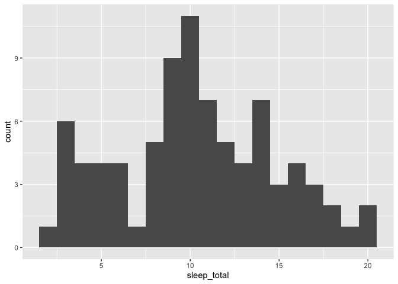<!-- -->


```r
msleep %>% 
  group_by(vore) %>%
    summarise(mean_sleep_total=mean(sleep_total))
```

```
## # A tibble: 5 x 2
##   vore    mean_sleep_total
##   <chr>              <dbl>
## 1 carni              10.4 
## 2 herbi               9.51
## 3 insecti            14.9 
## 4 omni               10.9 
## 5 <NA>               10.2
```


```r
msleep %>%
  ggplot(aes(x=sleep_total, fill=vore)) + geom_histogram(binwidth = 1, alpha=0.5) +
     theme_bw()
```

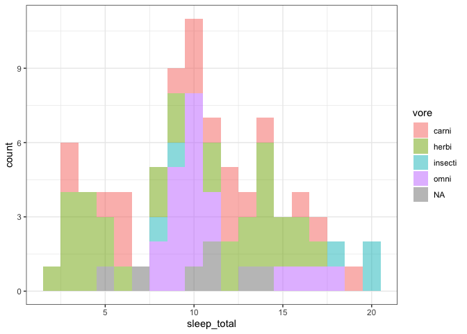<!-- -->


```r
msleep %>%
  ggplot(aes(x=sleep_total, fill=vore)) + geom_density(alpha=0.5) +
     theme_bw()
```

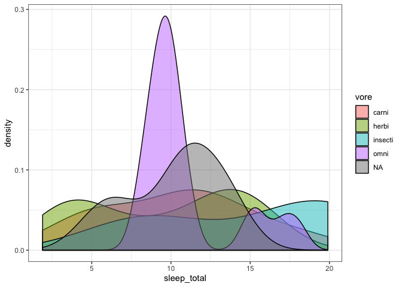<!-- -->


```r
msleep %>%
  ggplot(aes(x=sleep_total, fill=vore)) + geom_density(alpha=0.5) + facet_wrap(~vore) +
     theme_bw()
```

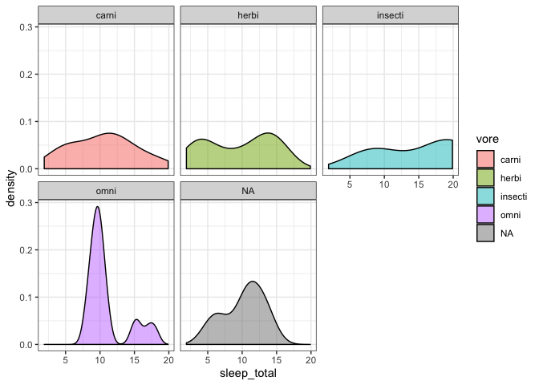<!-- -->


```r
msleep %>%
  ggplot(aes(x=sleep_total, fill=vore)) + geom_histogram(alpha=0.5, binwidth=1) + facet_wrap(~vore) +
     theme_bw() 
```

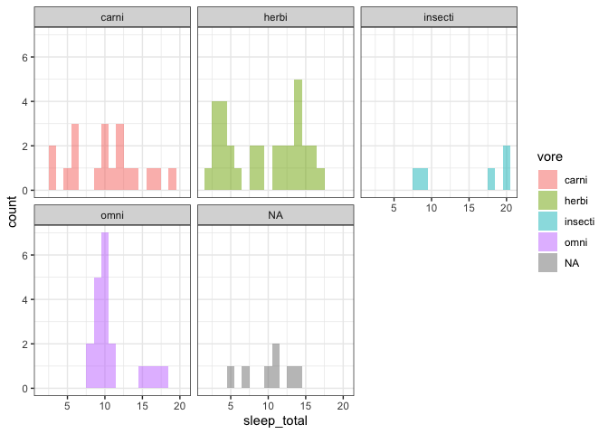<!-- -->


```r
msleep %>% 
  group_by(order) %>%
    summarise(mean_sleep_total=mean(sleep_total)) %>%
        ggplot(mapping=aes(x=order, y=mean_sleep_total)) + geom_col() +
          theme(axis.text.x = element_text(angle=90))
```

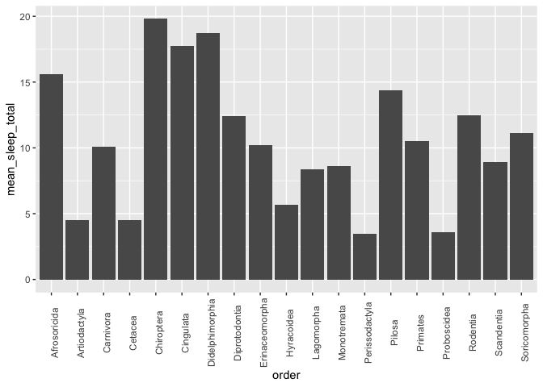<!-- -->


```r
msleep %>% 
  group_by(order, vore) %>%
    summarise(mean_sleep_total=mean(sleep_total)) %>%
        ggplot(mapping=aes(x=order, y=mean_sleep_total, fill=vore)) + geom_col() +
          theme(axis.text.x = element_text(angle=90))
```

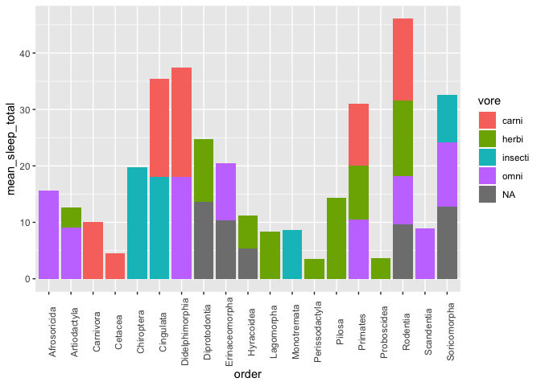<!-- -->


```r
msleep %>%
  ggplot(mapping=aes(x=brainwt, y=sleep_total)) + geom_point() + geom_smooth(method='lm')
```

```
## Warning: Removed 27 rows containing non-finite values (stat_smooth).
```

```
## Warning: Removed 27 rows containing missing values (geom_point).
```

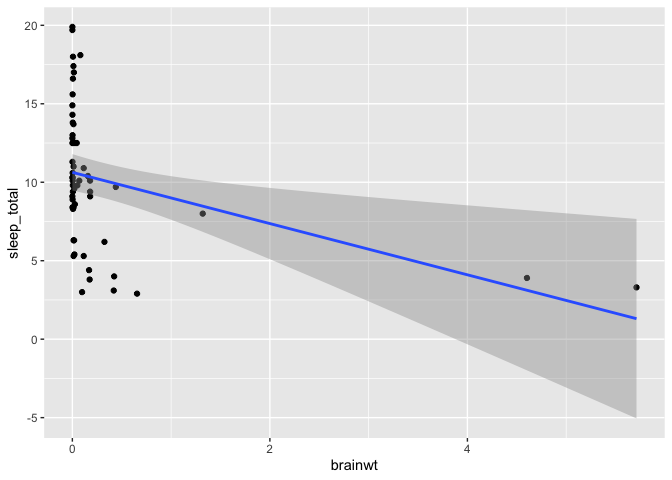<!-- -->


```r
msleep %>%
  mutate(brainwt_ln=log(brainwt), sleep_total_ln=log(sleep_total)) %>%
  ggplot(mapping=aes(x=brainwt_ln, y=sleep_total_ln)) + geom_point() + geom_smooth(method='lm')
```

```
## Warning: Removed 27 rows containing non-finite values (stat_smooth).
```

```
## Warning: Removed 27 rows containing missing values (geom_point).
```

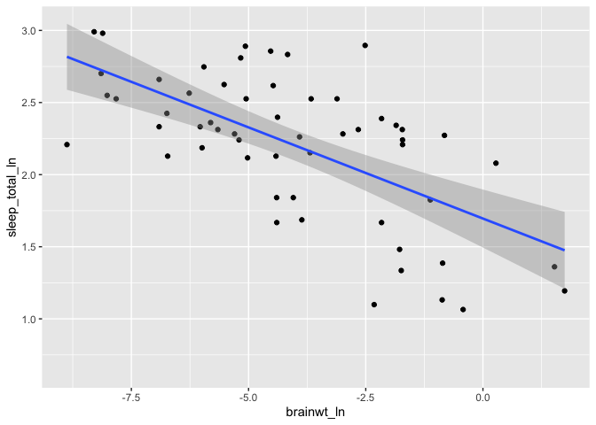<!-- -->


```r
msleep %>%
  mutate(brainwt_ln=log(brainwt), sleep_total_ln=log(sleep_total)) %>%
  ggplot(mapping=aes(x=brainwt_ln, y=sleep_total_ln, fill=vore)) + geom_point() + geom_smooth(method='lm')
```

```
## Warning: Removed 27 rows containing non-finite values (stat_smooth).
```

```
## Warning: Removed 27 rows containing missing values (geom_point).
```

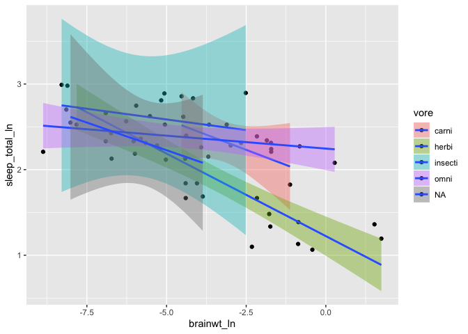<!-- -->


```r
msleep %>%
  mutate(brainwt_ln=log(brainwt), sleep_total_ln=log(sleep_total)) %>%
  ggplot(mapping=aes(x=brainwt_ln, y=sleep_total_ln, fill=vore)) + 
  geom_point() + geom_smooth(method='lm') + 
  facet_wrap(~vore) +
  theme_linedraw()
```

```
## Warning: Removed 27 rows containing non-finite values (stat_smooth).
```

```
## Warning: Removed 27 rows containing missing values (geom_point).
```

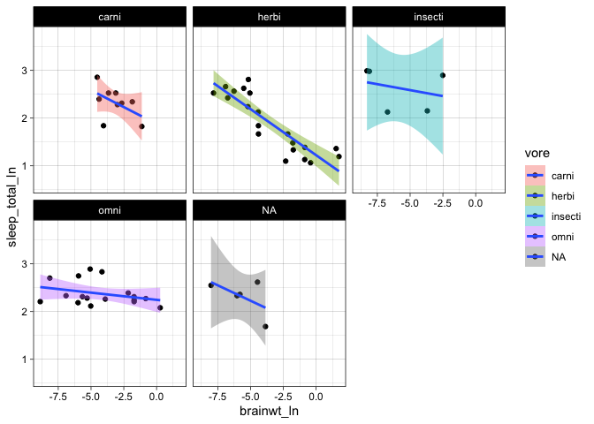<!-- -->


```r
flu_act <- read.csv('data/flu_activity_by_state_2008-09.csv')
```


```r
flu_act %>%
    group_by('WEEK') %>%
      ggplot(mapping=aes(x=factor(WEEK), fill=ACTIVITYESTIMATE)) + geom_bar() +
        labs(x='week', y='number of states', title="Flu activity level by state across 2008-9 season")
```

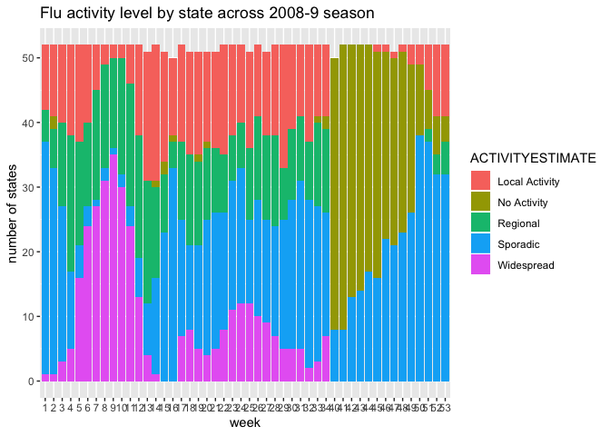<!-- -->


```r
ps <- read.csv('data/Police_Stations.csv')
ps %>% kable() %>% kable_styling()
```

<table class="table" style="margin-left: auto; margin-right: auto;">
 <thead>
  <tr>
   <th style="text-align:right;"> X </th>
   <th style="text-align:right;"> Y </th>
   <th style="text-align:right;"> OBJECTID </th>
   <th style="text-align:right;"> DISTRICT_NUMBER </th>
   <th style="text-align:left;"> LOCATION </th>
   <th style="text-align:left;"> TELEPHONE_NUMBER </th>
   <th style="text-align:left;"> RULEID </th>
  </tr>
 </thead>
<tbody>
  <tr>
   <td style="text-align:right;"> -75.03270 </td>
   <td style="text-align:right;"> 40.09098 </td>
   <td style="text-align:right;"> 1 </td>
   <td style="text-align:right;"> 7 </td>
   <td style="text-align:left;"> Bustleton Ave &amp; Bowler St </td>
   <td style="text-align:left;"> 686-3070 </td>
   <td style="text-align:left;"> Rule_1 </td>
  </tr>
  <tr>
   <td style="text-align:right;"> -75.17700 </td>
   <td style="text-align:right;"> 40.03843 </td>
   <td style="text-align:right;"> 2 </td>
   <td style="text-align:right;"> 14 </td>
   <td style="text-align:left;"> Haines St &amp; Germantown Ave </td>
   <td style="text-align:left;"> 686-3140 </td>
   <td style="text-align:left;"> Rule_1 </td>
  </tr>
  <tr>
   <td style="text-align:right;"> -74.99730 </td>
   <td style="text-align:right;"> 40.08011 </td>
   <td style="text-align:right;"> 3 </td>
   <td style="text-align:right;"> 8 </td>
   <td style="text-align:left;"> Academy Rd &amp; Red Lion Rd </td>
   <td style="text-align:left;"> 686-3080 </td>
   <td style="text-align:left;"> Rule_1 </td>
  </tr>
  <tr>
   <td style="text-align:right;"> -75.06325 </td>
   <td style="text-align:right;"> 40.03149 </td>
   <td style="text-align:right;"> 4 </td>
   <td style="text-align:right;"> 2 </td>
   <td style="text-align:left;"> Harbison Ave &amp; Levick St </td>
   <td style="text-align:left;"> 686-3020 </td>
   <td style="text-align:left;"> Rule_1 </td>
  </tr>
  <tr>
   <td style="text-align:right;"> -75.14365 </td>
   <td style="text-align:right;"> 40.04450 </td>
   <td style="text-align:right;"> 5 </td>
   <td style="text-align:right;"> 35 </td>
   <td style="text-align:left;"> N Broad St &amp; Champlost St </td>
   <td style="text-align:left;"> 686-3350 </td>
   <td style="text-align:left;"> Rule_1 </td>
  </tr>
  <tr>
   <td style="text-align:right;"> -75.06325 </td>
   <td style="text-align:right;"> 40.03149 </td>
   <td style="text-align:right;"> 6 </td>
   <td style="text-align:right;"> 15 </td>
   <td style="text-align:left;"> Harbison Ave &amp; Levick St </td>
   <td style="text-align:left;"> 686-3150 </td>
   <td style="text-align:left;"> Rule_1 </td>
  </tr>
  <tr>
   <td style="text-align:right;"> -75.22440 </td>
   <td style="text-align:right;"> 40.04020 </td>
   <td style="text-align:right;"> 7 </td>
   <td style="text-align:right;"> 5 </td>
   <td style="text-align:left;"> Ridge Ave &amp; Cinnaminson St </td>
   <td style="text-align:left;"> 686-3050 </td>
   <td style="text-align:left;"> Rule_1 </td>
  </tr>
  <tr>
   <td style="text-align:right;"> -75.16425 </td>
   <td style="text-align:right;"> 40.01090 </td>
   <td style="text-align:right;"> 8 </td>
   <td style="text-align:right;"> 39 </td>
   <td style="text-align:left;"> 22nd St &amp; Hunting Park Ave </td>
   <td style="text-align:left;"> 686-3390 </td>
   <td style="text-align:left;"> Rule_1 </td>
  </tr>
  <tr>
   <td style="text-align:right;"> -75.12250 </td>
   <td style="text-align:right;"> 40.00874 </td>
   <td style="text-align:right;"> 9 </td>
   <td style="text-align:right;"> 25 </td>
   <td style="text-align:left;"> 3901 Whitaker Ave </td>
   <td style="text-align:left;"> 686-3250 </td>
   <td style="text-align:left;"> Rule_1 </td>
  </tr>
  <tr>
   <td style="text-align:right;"> -75.16240 </td>
   <td style="text-align:right;"> 39.98079 </td>
   <td style="text-align:right;"> 10 </td>
   <td style="text-align:right;"> 22 </td>
   <td style="text-align:left;"> 17th St &amp; Montgomery Ave </td>
   <td style="text-align:left;"> 686-3220 </td>
   <td style="text-align:left;"> Rule_1 </td>
  </tr>
  <tr>
   <td style="text-align:right;"> -75.12250 </td>
   <td style="text-align:right;"> 40.00874 </td>
   <td style="text-align:right;"> 11 </td>
   <td style="text-align:right;"> 24 </td>
   <td style="text-align:left;"> 3901 Whitaker Ave </td>
   <td style="text-align:left;"> 686-3240 </td>
   <td style="text-align:left;"> Rule_1 </td>
  </tr>
  <tr>
   <td style="text-align:right;"> -75.12708 </td>
   <td style="text-align:right;"> 39.97132 </td>
   <td style="text-align:right;"> 12 </td>
   <td style="text-align:right;"> 26 </td>
   <td style="text-align:left;"> E Girard Ave &amp; Montgomery Ave </td>
   <td style="text-align:left;"> 686-3260 </td>
   <td style="text-align:left;"> Rule_1 </td>
  </tr>
  <tr>
   <td style="text-align:right;"> -75.24090 </td>
   <td style="text-align:right;"> 39.97132 </td>
   <td style="text-align:right;"> 13 </td>
   <td style="text-align:right;"> 19 </td>
   <td style="text-align:left;"> 61st  St &amp; Thompson St </td>
   <td style="text-align:left;"> 686-3190 </td>
   <td style="text-align:left;"> Rule_1 </td>
  </tr>
  <tr>
   <td style="text-align:right;"> -75.20015 </td>
   <td style="text-align:right;"> 39.96193 </td>
   <td style="text-align:right;"> 14 </td>
   <td style="text-align:right;"> 16 </td>
   <td style="text-align:left;"> 39th St &amp; Lancaster Ave </td>
   <td style="text-align:left;"> 686-3160 </td>
   <td style="text-align:left;"> Rule_1 </td>
  </tr>
  <tr>
   <td style="text-align:right;"> -75.17159 </td>
   <td style="text-align:right;"> 39.96080 </td>
   <td style="text-align:right;"> 15 </td>
   <td style="text-align:right;"> 9 </td>
   <td style="text-align:left;"> 20th St &amp; Pennsylvania Ave </td>
   <td style="text-align:left;"> 686-3090 </td>
   <td style="text-align:left;"> Rule_1 </td>
  </tr>
  <tr>
   <td style="text-align:right;"> -75.15719 </td>
   <td style="text-align:right;"> 39.95684 </td>
   <td style="text-align:right;"> 16 </td>
   <td style="text-align:right;"> 6 </td>
   <td style="text-align:left;"> 11th St &amp; Winter St </td>
   <td style="text-align:left;"> 686-3060 </td>
   <td style="text-align:left;"> Rule_1 </td>
  </tr>
  <tr>
   <td style="text-align:right;"> -75.23217 </td>
   <td style="text-align:right;"> 39.95429 </td>
   <td style="text-align:right;"> 17 </td>
   <td style="text-align:right;"> 18 </td>
   <td style="text-align:left;"> 55th St &amp; Pine St </td>
   <td style="text-align:left;"> 686-3180 </td>
   <td style="text-align:left;"> Rule_1 </td>
  </tr>
  <tr>
   <td style="text-align:right;"> -75.17676 </td>
   <td style="text-align:right;"> 39.93724 </td>
   <td style="text-align:right;"> 18 </td>
   <td style="text-align:right;"> 17 </td>
   <td style="text-align:left;"> 20th St &amp; Federal St </td>
   <td style="text-align:left;"> 686-3170 </td>
   <td style="text-align:left;"> Rule_1 </td>
  </tr>
  <tr>
   <td style="text-align:right;"> -75.16229 </td>
   <td style="text-align:right;"> 39.93345 </td>
   <td style="text-align:right;"> 19 </td>
   <td style="text-align:right;"> 3 </td>
   <td style="text-align:left;"> 11th St &amp; Wharton St </td>
   <td style="text-align:left;"> 686-3030 </td>
   <td style="text-align:left;"> Rule_1 </td>
  </tr>
  <tr>
   <td style="text-align:right;"> -75.23434 </td>
   <td style="text-align:right;"> 39.92556 </td>
   <td style="text-align:right;"> 20 </td>
   <td style="text-align:right;"> 12 </td>
   <td style="text-align:left;"> 65th St &amp; Woodland Ave </td>
   <td style="text-align:left;"> 686-3120 </td>
   <td style="text-align:left;"> Rule_1 </td>
  </tr>
  <tr>
   <td style="text-align:right;"> -75.18693 </td>
   <td style="text-align:right;"> 39.92407 </td>
   <td style="text-align:right;"> 21 </td>
   <td style="text-align:right;"> 1 </td>
   <td style="text-align:left;"> 24th St &amp; Wolf St </td>
   <td style="text-align:left;"> 686-3010 </td>
   <td style="text-align:left;"> Rule_1 </td>
  </tr>
  <tr>
   <td style="text-align:right;"> -75.15235 </td>
   <td style="text-align:right;"> 39.95454 </td>
   <td style="text-align:right;"> 22 </td>
   <td style="text-align:right;"> 0 </td>
   <td style="text-align:left;"> Police Headquarters </td>
   <td style="text-align:left;">  </td>
   <td style="text-align:left;"> Rule_1 </td>
  </tr>
  <tr>
   <td style="text-align:right;"> -75.15194 </td>
   <td style="text-align:right;"> 39.94926 </td>
   <td style="text-align:right;"> 23 </td>
   <td style="text-align:right;"> 0 </td>
   <td style="text-align:left;"> Center City District </td>
   <td style="text-align:left;">  </td>
   <td style="text-align:left;"> Rule_1 </td>
  </tr>
  <tr>
   <td style="text-align:right;"> -75.20302 </td>
   <td style="text-align:right;"> 39.95660 </td>
   <td style="text-align:right;"> 24 </td>
   <td style="text-align:right;"> 0 </td>
   <td style="text-align:left;"> 40th &amp; Chestnut-U-Penn </td>
   <td style="text-align:left;">  </td>
   <td style="text-align:left;"> Rule_1 </td>
  </tr>
</tbody>
</table>

```r
shoot_df <- read.csv('data/openphilly_data_shootings.csv')
```


```r
base <- qmplot(data=ps, 
               x=X, y=Y, 
               geom='blank', 
               maptype='toner-background', 
               darken=0.4, 
               legend = 'topleft')
```

```
## Using zoom = 12...
```

```
## Source : http://tile.stamen.com/terrain/12/1191/1549.png
```

```
## Source : http://tile.stamen.com/terrain/12/1192/1549.png
```

```
## Source : http://tile.stamen.com/terrain/12/1193/1549.png
```

```
## Source : http://tile.stamen.com/terrain/12/1194/1549.png
```

```
## Source : http://tile.stamen.com/terrain/12/1191/1550.png
```

```
## Source : http://tile.stamen.com/terrain/12/1192/1550.png
```

```
## Source : http://tile.stamen.com/terrain/12/1193/1550.png
```

```
## Source : http://tile.stamen.com/terrain/12/1194/1550.png
```

```
## Source : http://tile.stamen.com/terrain/12/1191/1551.png
```

```
## Source : http://tile.stamen.com/terrain/12/1192/1551.png
```

```
## Source : http://tile.stamen.com/terrain/12/1193/1551.png
```

```
## Source : http://tile.stamen.com/terrain/12/1194/1551.png
```

```r
base + 
  geom_point(mapping=aes(x=X, y=Y), color='blue', size=0.1) + 
  geom_text(mapping=aes(x=X,y=Y, label=gsub('&','\n&',LOCATION)), size=2.5, alpha=0.4)
```

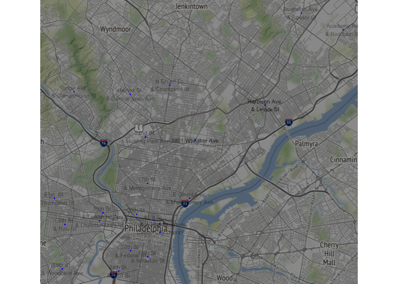<!-- -->


```r
base_plot <- qmplot(data=shoot_df, 
               x=point_x, y=point_y, 
               geom='blank', 
               maptype='toner-background', 
               darken=0.4, 
               legend = 'topleft')
```

```
## Using zoom = 12...
```

```
## Source : http://tile.stamen.com/terrain/12/1191/1548.png
```

```
## Source : http://tile.stamen.com/terrain/12/1192/1548.png
```

```
## Source : http://tile.stamen.com/terrain/12/1193/1548.png
```

```
## Source : http://tile.stamen.com/terrain/12/1194/1548.png
```

```
## Source : http://tile.stamen.com/terrain/12/1195/1548.png
```

```
## Source : http://tile.stamen.com/terrain/12/1195/1549.png
```

```
## Source : http://tile.stamen.com/terrain/12/1195/1550.png
```

```
## Source : http://tile.stamen.com/terrain/12/1195/1551.png
```

```
## Source : http://tile.stamen.com/terrain/12/1191/1552.png
```

```
## Source : http://tile.stamen.com/terrain/12/1192/1552.png
```

```
## Source : http://tile.stamen.com/terrain/12/1193/1552.png
```

```
## Source : http://tile.stamen.com/terrain/12/1194/1552.png
```

```
## Source : http://tile.stamen.com/terrain/12/1195/1552.png
```

```r
base_plot + geom_polygon(stat='density2d', mapping=aes(fill=stat(level)), alpha=0.3) + scale_fill_gradient2("Shootings", low='white', high='red') + geom_point(data=ps, aes(x=X, y=Y), color='blue', size=0.2)
```

```
## Warning: Removed 70 rows containing non-finite values (stat_density2d).
```

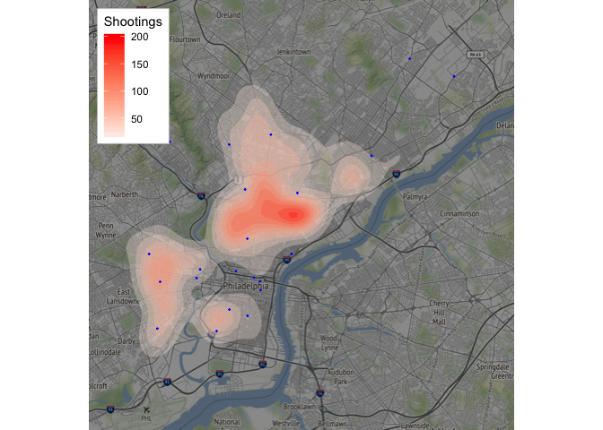<!-- -->


